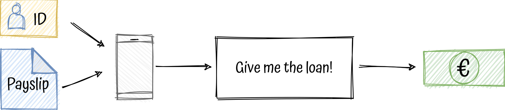

# functional-domain-driven-design
A pragmatic and balanced approach to combine DDD, FP, hexagonal architecture, microservices all together with Kotlin.

## Introduction TL;DR

As a developer, I've been working almost all my career in JS and java, imperative OOP and layered architectures,
through different companies and variety of domains.

Some years ago a decided to open my mind, I learned functional programming with Scala, at least I tried, my head almost exploded.
I also tried different programming languages, such as ruby, elixir, typescript or even ocaml, till finally in I fell in love
with kotlin .

One day I realised that I didn't know what the S of Solid really meant, so it led me to understand dependency-inversion
and fell in love again, this time with hexagonal architecture.

Parallel to all of that, I learned that software engineers should not work alone and isolated, we need to work together,
 so, welcome agile and [XP](https://en.wikipedia.org/wiki/Extreme_programming).

What was next? divide and conquer! microservice architectures, time to create small, autonomous and decoupled services, well I
thought I was, actually I was going more to the path of creating distributed monoliths.

Still, something was missing, that's when I was introduced to domain-driven design. Wow, how it was possible to work all
those years without paying attention to the most important thing? The focus on the business.

  

Now, I still feel that I know nothing, but in this project I want to try to put everything together, DDD, FP,
hexagonal, microservices and kotlin in a real complex scenario.

## The problem

Software is meant to solve problems, therefore let's imagine an imaginary company to have a something to solve.

### The domain

In DDD terminology, the domain is the group of business problems we are trying to solve usually associated with one activity,
in our case our imaginary activity is an online company that gives **Fast Personal Loans** called **Give me the loan**.

The idea is pretty simple, you download the mobile app, create an account, take one **photo** of your **ID** and some of your
last **payslips** and ask for a personal loan with a **very low interests!**.

  

### Breaking down the problem - Bounded contexts

### Understanding Loan Evaluation BC

## The solution

