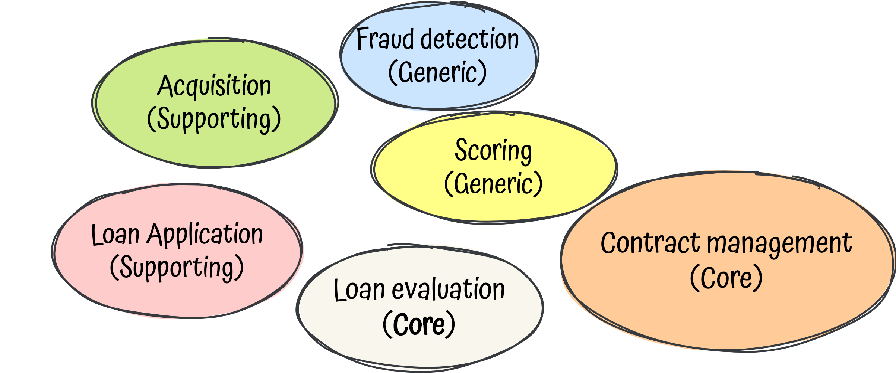

# functional-domain-driven-design
A pragmatic and balanced approach to combine DDD, FP, hexagonal architecture, microservices all together with Kotlin.

## Introduction TL;DR

As a developer, I've been working almost all my career in JS and java, imperative OOP and layered architectures,
through different companies and variety of domains.

Some years ago a decided to open my mind, I learned functional programming with Scala, at least I tried, my head almost exploded.
I also tried different programming languages, such as ruby, elixir, typescript or even ocaml, till finally in I fell in love
with kotlin .

One day I realised that I didn't know what the S of Solid really meant, so it led me to understand dependency-inversion and
the architectures based on it, I fell in love again, this time with hexagonal architecture.

Parallel to all of that, I learned that software engineers should not work alone and isolated, we need to work together,
 so, welcome agile and [XP](https://en.wikipedia.org/wiki/Extreme_programming).

What was next? divide and conquer! microservice architectures, time to create small, autonomous and decoupled services, well I
thought I was. Actually, I was going more to the path of creating distributed monoliths.

Still, something was missing, that's when I was introduced to domain-driven design. Wow, how it was possible to work all
those years without paying attention to the most important thing? **The business**.

Let's put everything together:

  

Wow, a lot of fuzzy words, right?

Now, I still feel that I know nothing, I had to review concepts time to time, but in this project I will try apply DDD,
FP, hexagonal, microservices and kotlin in a real complex scenario in order to see how powerful they are.

## The problem

Software is meant to solve problems, therefore, let's imagine something to solve then ...

**Note**: This section and the following one are about DDD, how decisions are affecting top-down, we will break down the
problem till get to implementations details, so feel free to jump directly to the [implementation section](#the-implementation) if you are not
interested, or you already master all the DDD concepts.

### The domain - Give me the loan!

In DDD terminology, the domain is the group of business problems we are trying to solve usually associated with one activity,
or more simple, what do we want to solve? In our case our imaginary activity is an online company that gives **Fast Personal Loans**
called **Give me the loan!**.

The idea is pretty simple, you download the mobile app, create an account, take one **photo** of your **ID** and some of your
last **payslips** and request for a personal loan with a **very low interests!**.

  

### Discovering the domain

We, as developers, are eager to code, but in order to do it efficiently, let's understand what we have to do first.
In DDD world, this part is the strategic part, a crucial aspect of DDD, discover the domain, break it down in
sub-problems, loose-coupled parts that we can tackle autonomously, **the sub-domains**.

There are some techniques to do so, but one of the most effective and quick to do it is a **big-picture [event-storming](https://www.eventstorming.com/)**,
a workshop-based method where we only need a big space, a wide wall, a lot of sticky notes and the right people.

  

I am not an expert of running this kind of workshop, and the goal of this post is not to explain it; but in a nutshell,
an [event-storming](https://en.wikipedia.org/wiki/Event_storming) is a collaborative and visual tool that can be used for
several purposes, one of them is to discover and decompose a domain into subdomains through domain events, which will
discovered and clustered by development teams and domain experts together (If you are already interested [here](https://github.com/ddd-crew/eventstorming-glossary-cheat-sheet) some tips.)

Coming back to our cool problem, let's suppose we have run this session with all the stakeholders and here the subdomains
as a result:

  

As you can see we also identified the different [types](https://thedomaindrivendesign.io/domains-and-subdomains/) of subdomains,
the **core** ones, the parts of the domain which have the greatest potential for business impact, supporting subdomains,
without them our Domain cannot be successful, and generic subdomains, the ones that could be even outsourced.

During these sessions we also spotted that a Loan have different meanings depending on the subdomain, we are discovering
the **ubiquitous language**, another DDD concept.

## The solution

### Bounded context

We have our company divided in different subdomains, we already know which ones are important, but what about teams, services,
repositories, in summary, **what about boundaries?**

Here it comes, one of the most important concepts of DDD, yes, this word so complicated to explain, the Bounded Contexts,
I really like to make an analogy with FP here, BCs are the monads of DDD, they are super important but everyone struggles
 to explain them.

But, what is exactly a bounded context?

> A bounded context is a delimited context that define explicit boundaries in terms of organization, concepts and vocabulary,
application, teams, code or even data within a subdomain.

Still broad and fuzzy?

Let's simplify it, a BC is just the other side of the problem, **the solution, how you solve your domain problems**.

Instead of try to elaborate a simple definition, we can define some rules to understand it better:
- A BC often maps one-to-one with a subdomain, but they cannot.
- A BC is owned by one, and only one team, but one team can own several BCs.
- A BC usually maps one-to-one with a service, but it can be split in several ones if the team decides to.
- A BC owns a set of concepts and vocabulary, shared by team members, domain experts and source code.
- A BC should be as autonomous as possible, enabling teams to deliver faster and independently of each other.

  

#### Bounded contexts and microservices

The original promise of microservices is to allow your teams to release frequently and independently of each other ... sounds familiar?
Yeah, bounded context and microservices are trying to achieve the same at different levels, that's why they are a perfect match!

  

### Loan Evaluation Context

### Context Mappings

## The implementation

