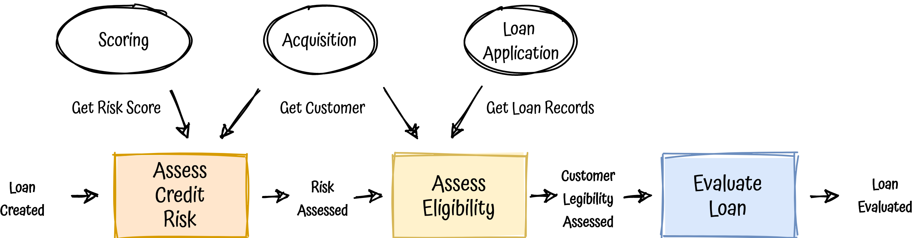
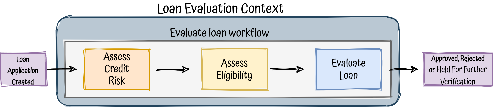
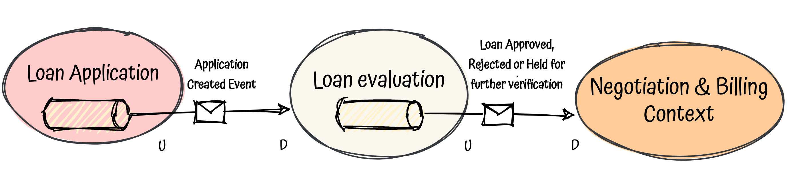

# functional-domain-driven-design
A pragmatic and balanced approach to combine DDD, FP, hexagonal architecture, microservices all together with Kotlin,
breaking down the problem in a top down approach.

## Introduction TL;DR

As a developer, I've been working almost all my career in JS and java, imperative OOP and layered architectures,
through different companies and variety of domains.

Some years ago a decided to open my mind, I learned functional programming with Scala, at least I tried, my head almost exploded.
I also tried different programming languages, such as ruby, elixir, typescript or even ocaml, till finally in I fell in love
with kotlin .

One day I realised that I didn't know what the S of Solid really meant, so it led me to understand dependency-inversion and
the architectures based on it, I fell in love again, this time with hexagonal architecture.

Parallel to all of that, I learned that software engineers should not work alone and isolated, we need to work together,
 so, welcome agile and [XP](https://en.wikipedia.org/wiki/Extreme_programming).

What was next? divide and conquer! microservice architectures, time to create small, autonomous and decoupled services, well I
thought I was. Actually, I was going more to the path of creating distributed monoliths.

Still, something was missing, that's when I was introduced to domain-driven design. Wow, how it was possible to work all
those years without paying attention to the most important thing? **The business**.

Let's put everything together:

<p align="center">
  
</p>

Wow, a lot of fuzzy words, right?

Now, I still feel that I know nothing, I had to review concepts time to time, but in this project I will try apply DDD,
FP, hexagonal, microservices and kotlin in a real complex scenario in order to see how powerful they are.


## The problem

Software is meant to solve problems, therefore, let's imagine something to solve then ...

**Note**: This section and the following one are about DDD, how decisions are affecting top-down, we will break down the
problem till get to implementations details, so feel free to jump directly to the [implementation section](#the-implementation) if you are not
interested, or you already master all the DDD concepts.

### The domain - Give me the loan!

In DDD terminology, the domain is the group of business problems we are trying to solve usually associated with one activity,
or more simple, what do we want to solve? In our case our imaginary activity is an online company that gives **Fast Personal Loans**
called **Give me the loan!**.

The idea is pretty simple, you download the mobile app, create an account, take one **photo** of your **ID** and some of your
last **payslips** and request for a personal loan with a **very low interests!**.

<p align="center">
  
</p>


### Discovering the domain

We, as developers, are eager to code, but in order to do it efficiently, let's understand what we have to do first.
In DDD world, this part is the strategic part, a crucial aspect of DDD, discover the domain, break it down in
sub-problems, loose-coupled parts that we can tackle autonomously, **the sub-domains**.

There are some techniques to do so, but one of the most effective and quickest way to do it is a **big-picture [event-storming](https://www.eventstorming.com/)**,
a workshop-based method where we only need a big space, a wide wall, a lot of sticky notes and the right people.

<p align="center">
  
</p>

I am not an expert of running this kind of workshop, and the goal of this post is not to explain it; but in a nutshell,
an [event-storming](https://en.wikipedia.org/wiki/Event_storming) is a collaborative and visual tool that can be used for
several purposes, one of them is to discover and decompose a domain into subdomains through domain events, which will
discovered and clustered by development teams and domain experts together (If you are already interested [here](https://github.com/ddd-crew/eventstorming-glossary-cheat-sheet) some tips.)

Coming back to our cool problem, let's suppose we have run this session with all the stakeholders and here the subdomains
as a result:

<p align="center">
  
</p>

As you can see we also identified the different [types](https://thedomaindrivendesign.io/domains-and-subdomains/) of subdomains,
the **core** ones, the parts of the domain which have the greatest potential for business impact, supporting subdomains,
without them our Domain cannot be successful, and generic subdomains, the ones that could be even outsourced.

Sub-domains summary:
- Acquisition:  Responsible for account creation, kyc and customer data.
- Fraud detection: Analise, extract data from upload customer docs and detect possible frauds (out-sourced).
- Scoring: Credit scoring (out-sourced).
- Loan application: All the loan application lifecycle.
- Loan evaluation: Basically, it decides if we should lend the money to the customer.
- Negotiation & Billing: All the loan management after a decision has been made, including negotiation, contracting, billing ...

During these sessions we also spotted that a Loan have different meanings depending on the subdomain, we are discovering
the **ubiquitous language**, another DDD concept.

## The solution

### Bounded context

We have our company divided in different subdomains, we already know which ones are important, but what about teams, services,
repositories, in summary, **what about boundaries?**

Here it comes, one of the most important concepts of DDD, yes, this word so complicated to explain, the Bounded Context,
I really like to make an analogy with FP here, BCs are the monads of DDD, they are super important but everyone struggles
 to explain them.

But, what is exactly a bounded context?

> A bounded context is a delimited context that define explicit boundaries in terms of organization, concepts and vocabulary,
application, teams, architecture, source-code or even data, most of the times within a subdomain.

Still broad and fuzzy?

Let's simplify it, a BC is just the other side of the problem, **the solution, how you solve your domain problem**.

Instead of try to elaborate a simple definition, we can define a set of rules to understand it better:
- A BC often maps one-to-one with a subdomain, but they cannot.
- A BC is owned by one, and only one team, but one team can own several BCs.
- A BC usually maps one-to-one with a service, but it can be split in several ones if the team decides to.
- A BC owns a set of concepts and vocabulary, a dialect of the UL, shared by team members, domain experts and source code.
- A BC should be as autonomous as possible, enabling teams to deliver faster and independently of each other.

<p align="center">
  
</p>

#### Bounded contexts and microservices

The original promise of microservices is to allow your teams to release frequently and independently of each other ... sounds familiar?
Yeah, bounded context and microservices are trying to achieve the same at different levels, that's why they are a perfect match!

<p align="center">
  
</p>

### Loan Evaluation Context

We are lucky, we have assigned to the team in charge of Loan Evaluation, one of the core bounded contexts, but, what we know
about it?

Luckily, we have tools in place, you remember the event-storming? the previous one was the big picture version, but there is
another one, a **Software Design Event-Storming**, a more granular version where we will discover the moving parts of a our software
implementation, again, developers and business experts together.

[diagram: TODO]

This exercise will give us an idea about the business workflows in terms of:

- Aggregates: In our case, only one, `Loan Evaluation`, it will be reflected in the code.
- Domain Events: **Things that happened in the domain that are relevant for the business, it does not mean that they will
be events in our implementation, they could be events or just states in our model**. Some of them will be published
to the outside world, the integration ones, committed events that occurred within our bounded context which may be interesting
to other domains, applications or third party services. We'll see later how they will be implemented.
- More shared model, more ubiquitous language, commands and events give us an idea of which methods, functions or domain components.
- Dependencies: Other contexts that our BC depends on
- Policies: a.k.a. business rules
- UI: Not applies here.


In summary, an idea of how our solution will look like.

### Business Workflows as pipelines

We have been tacking about DDD concepts enough, we have our domain divided, we have aggregates, domain events, we know
how our solution would look like but now is time to introduce some functional concepts at business level.

What is a function?

<p align="center">
  
</p>

We can see it black box with an input and output.

If we chain them, we obtain a [pipeline](https://martinfowler.com/articles/collection-pipeline/), a really common pattern in functional programming.

<p align="center">
  
</p>

Cool, what if we try to apply the same concepts, thinking in data flow transformations at business level?

<p align="center">
  
</p>

Our pipeline is now a workflow, we just changed the name ;)

After the event storming and talking with domain experts we also know which dependencies we are going to have,
let's add them to our workflow.

<p align="center">
  
</p>

Wow, don't we have a better idea of what we have to do?

Now, just one step back, put the workflow in the bounded context:

<p align="center">
  
</p>

In summary, looking at the workflow as a pipeline, we are able break down the work in steps, small chunks of work that we
can tackle independently and chain it to fulfill our goal, evaluate a loan.

### Communication with other bounded contexts

Let's assume that all our teams are working together to achieve the main goal in a partnership way, I don't want to talk
 about [context mappings](https://www.oreilly.com/library/view/domain-driven-design-distilled/9780134434964/ch04.html) or [team topologies](https://teamtopologies.com/) in this post.

Our bounded contexts are not totally isolated, they are going to talk each other, in our case, evaluate a loan is part
of a bigger user journey, requesting for a loan.

This is how our BC, `loan evaluation context` is going to communicate:

<p align="center">
  
</p>

Pretty easy, a total async and event-driven approach, when `Loan Application Context` process successfully a new
application for a loan, it is going to publish an event,`Loan Evaluation Context` (our BC) is going to consume it, evaluate
it and publish the result in our stream, where our consumers are going to listen, and one of them `Negotation & Billing Context`
will proceed with the negotiation, contracting and billing.

What about communications with dependencies in our workflow?

<p align="center">
  
</p>

- **Get Risk Score** dependency: we will need to request for a risk score each time we need to assess a loan.
- **Get Customer** dependency: Acquisition context is publishing all the customer events, hence we will replicate all
the customer info in our local database.
- **Get Loan Records** dependency: Besides Application Loan Created Event, Loan Application context is publishing all the
application loan lifecycle events, therefore we will listen, replicate and keep tracking of all loan states in our local
database.


## The implementation

We are going to work with the assumption that our bounded context is going to be one implemented for now in just one microservice,
if it grows, we will decide together with our team if we need to split it.

### Applying hexagonal architecture

To create a micro-service we need an architectural pattern to organise the code and its different concerns, in our case
we are going to apply hexagonal architecture (a.k.a. ports & adapters), since it is domain-centric approach, it is the perfect
chassis for our DDD project.

<p align="center">
  
</p>

Explain hexagonal architecture is not the goal of this project, ([here](https://github.com/albertllousas/implementing-hexagonal-architecture) a deep explanation), but in a nutshell
hexagonal architecture is just a way to apply dependency-inversion (S of SOLID).
You could think about hexagonal as [Encapsulation](https://en.wikipedia.org/wiki/Encapsulation_(computer_programming)) applied at business level.

<p align="center">
  
</p>

From the external world perspective, we are going to expose certain functionalities through the inbound ports, the only way to
access to the inner hexagon, our business.

Hexagonal together with domain-driven design build blocks looks like this:

<p align="center">
  
</p>

Hexagonal code packaging:
```
- Application Services: The use cases, the exposed business workflows
- Domain model: domain and ports
- Infrastructure: inbound & outbound adapters, configuration ...
```

### Anemic domain model anti-pattern in FP

[Anemic domain](https://martinfowler.com/bliki/AnemicDomainModel.html) is an anti-pattern in DDD, in an OOP oriented DDD,
domains are rich, giving to the domain real data and also behaviour.

Functional programming advocates to separate data and behaviour, having [algebraic data types](https://en.wikipedia.org/wiki/Algebraic_data_type) on one side and functions over them on the
other. You could think that FP clash with DDD because empowers anemic domain models but it is not true.

At its heart, an anemic model is a model where the business rules are not being encapsulated by the model itself;
instead of that, the behaviour is spread around a bunch of services out of the model, usually clients of it, ending up with
just procedural code.

Therefore, in FP, the model should contain the business rules, maybe just functions over the model but they would be part
of the model as well.

IMHO, this is how to apply DDD in FP context:

- **Entities**: Algebraic data types + Functions (if needed)
- **Value Objects (VO, Tiny types)**: Algebraic data types
- **Factories**: Smart constructors or just Functions
- **Aggregates**: Aggregate root + Entities + V.O. + Functions
- **Domain Services**: Functions
- **Repositories or any external dependency**: Type abstractions in the domain

### Writing declarative and type-driven workflows

First let's add some context in the title statement.

> Imperative says how to do it. And declarative says what to do.

> Type-driven development is a style of programming in which we write types first and use those types to guide the
> definition of functions.

There are a lot of definitions of both concepts, but from my perspective being type-driven is just about be declarative,
think in what we want to do before thinking in how to do it (implementation details).
This kind of thinking force you to:
 - Have **meaningful types** that express what your code is doing and postpone the how.
 - Be **consumer-driven**, think from the client perspective, your public API.

Having said that, imagine that we already started to implement our solution and it's time to code our workflow.

The place to implement the **workflow** is the where the use-cases of the application will be placed, in DDD
 nomenclature, the **application services**, the orchestrators of our business.

Keeping in mind our previous workflow:

<p align="center">
  
</p>

First of all, let's be type driven and define the functionality that we are going to expose to the world in terms of a
contract:

Our API:
```kotlin
typealias EvaluateLoan = (LoanEvaluationRequest) -> Either<Error, Unit>
data class LoanEvaluationRequest(val id: UUID, val customerId: UUID, val amount: BigDecimal)
```

The type is self-explanatory, we want to evaluate a loan given a loan request, the result, either an error or just side-effects;
in our business, we don't know about the loan application created event coming from other context, it will be handled in the
business client, the stream consumer adapter.

Let's implement the workflow, again, let's be declarative, we already know how our pipeline steps:
```kotlin
typealias AssessCreditRisk = (UnevaluatedLoan) -> Either<Error, RiskAssessed>
typealias AssessEligibility = (RiskAssessed) -> Either<Error, EligibilityAssessed>
typealias EvaluateLoanApplication = (EligibilityAssessed) -> EvaluatedLoan
typealias CreateEvents = (EvaluatedLoan) -> List<DomainEvent>
typealias SaveLoanEvaluation = (EvaluatedLoan) -> Unit
typealias PublishEvents = (List<DomainEvent>) -> Unit
```
We can just create our application service (a.k.a business workflow):
```kotlin
fun evaluateLoanService(
    assessCreditRisk: AssessCreditRisk,
    assessEligibility: AssessEligibility,
    evaluateLoanApplication: EvaluateLoanApplication,
    saveLoanEvaluation: SaveLoanEvaluation,
    createEvents: CreateEvents,
    publishEvents: PublishEvents
): EvaluateLoan = { request ->
    request
        .loanApplication()
        .let(assessCreditRisk)
        .flatMap(assessEligibility)
        .map(evaluateLoanApplication)
        .peek(saveLoanEvaluation)
        .map(createEvents)
        .map(publishEvents)
}
```

> Shall we include external dependencies in this stage?

Well it depends, matter of taste, in my case I  prefer to go one step further and be dependency agnostic in the workflows
as well, remember about being type-driven, how things are done is not really so important, we want to be declarative,
focusing on what we want to do.

> Who is going to implement this types?

They will be implemented in the domain, as domain services or directly functions on
the aggregates or as a infrastructure services (a.k.a outgoing adapters), calling the external world (DBs, other services, logs, metrics ...)

> That's a lot of abstraction, I don't need that

Well, they are just expressive and meaningful types, now **our code talks the business language**, the workflow just reflects
the diagram that we wrote together with business experts, it is really easy to follow, even for a non-technical person.

**Side note:** Outside-in tdd helps a lot in this way of coding, the design would flow better.

### Code that talks the business language

### Error handling: Monads come to the party

*Monads* are a functional pattern, I am not going even try to explain, but they are useful for several purposes, one of them error handling
Familiar with Railway programming?
We have pipes we chain functions, let add errors to the equation

### DDD building blocks

### Wiring up everything

#### External dependencies

// diagram with inmemory and so on

## Run the project

### Running the tests

# Glossary:

- BC : Bounded Context
- UL : Ubiquitous Language
- FP : Functional programming
- DDD : Domain-driven design
- VO : Value Object
- TDD : Test-driven development


